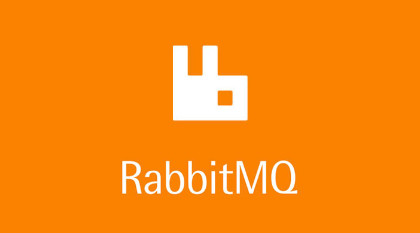

# API KAFKA

Este é um projeto Java 17 com Spring Boot e Kafka, que consiste em um produtor e um consumidor de mensagens.

 - o producer cria a mensagem via Topic que no meu caso é 'test-topic' e o consumer recebe a mensagem e salva no banco de dados postgresql.


## Tech usadas  

- Java 17 
- Postgresql
- Apache Kafka
- Docker

## Rodando projeto 

#### Clone o repositório:
```shell
 git clone https://github.com/carlinhoshk/estudos-kafka.git
```

#### Suba os containers:

```shell 
 docker-compose up -d
```


#### Execute os 2 serviços:


#### Teste a rota da API em:
```shell
  http://localhost:8080/users/new
```


#### Acesse o banco de dados e cheque os dados do container postgres
( todas info da conexao estao no arquivo docker-compose.yml):
```shell
  localhost:5432
```


### Motivações e considerações finais. 

#### Fiz o projeto para aprender mais sobre Kafka e focar no mercado de trabalho. Tinha conhecimentos anteriores em mensagerias como RabbitMQ.  
*que, particularmente, eu gostei e achei muito mais divertido. A própria empresa da ferramenta disponibiliza uma imagem Docker oficial para uso.*

Por fim, foi de grande aprendizado desenvolver e ver os primeiros passos com a ferramenta Kafka. Pretendo utilizar em outros projetos mais complexos e com mais serviços do que os utilizados nesse projeto.

